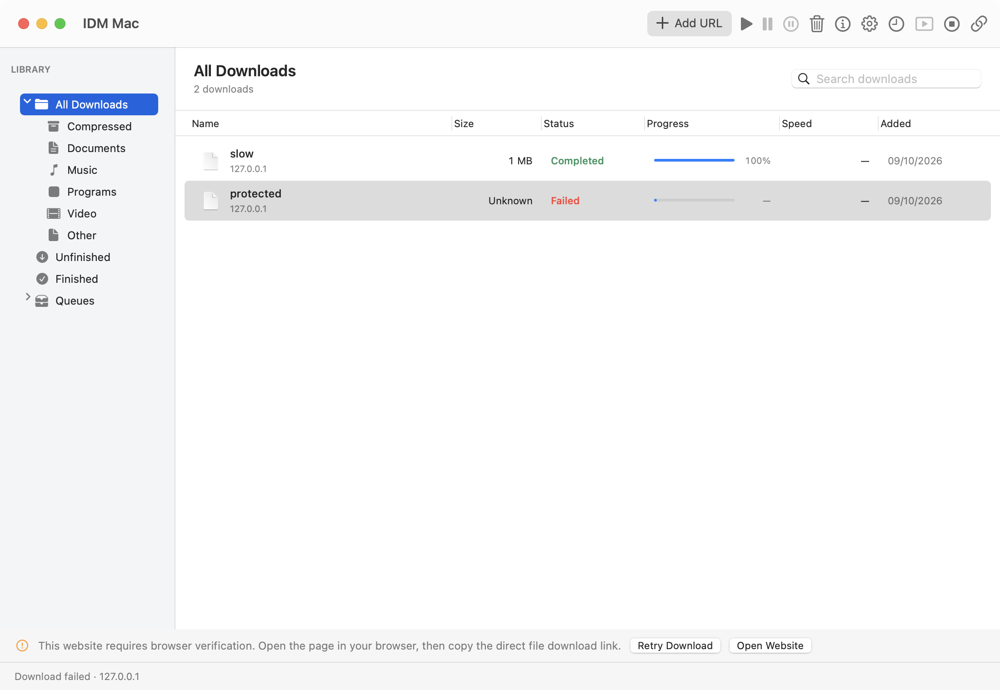

# IDM Mac

**A personal, native Apple Silicon download manager informed by reverse engineering of Windows IDM.**

Swift 6 · AppKit · URLSession · SQLite · Keychain · macOS 15+

This is an independent project for `haseeb-heaven`, with no affiliation or endorsement from Tonec. It is not an official “IDM for Mac” release. The owner's Windows copy supplies the analysis and execution reference.



## Start here

| Topic | Evidence |
| --- | --- |
| How the macOS implementation was built | [Native port, provenance, architecture, and tools](docs/native-port.md) |
| Original executable analysis | [GhidraMCP and Radare2 MCP findings](docs/findings/http-engine.md) |
| Download correctness | [Real URLs, file sizes, and SHA-256 results](docs/real-url-verification.md) |
| Original IDM speed comparison | [Paired download methodology and results](docs/speed-comparison.md) |
| Feature status and limitations | [Coverage matrix](docs/parity.md) |
| Regression checks and review | [Verification record](docs/verification.md) |

## Build and run

```sh
git clone git@github.com:haseeb-heaven/idm-mac-os.git
cd idm-mac-os
scripts/package.sh
open "build/IDM Mac.app"
```

Requirements: Apple Silicon Mac, macOS 15+, Swift 6 Command Line Tools, and Python 3.12 for test fixtures. The Swift package has no external dependencies. A full Xcode installation is unnecessary. `scripts/swift.sh` handles the inconsistent SwiftPM interfaces on the development Mac using a project-local public-interface copy.

The release bundle is locally ad hoc signed. App data is stored in `~/Library/Application Support/IDMMac/`; credentials are stored in Keychain.

## Features

- Manual HTTP/HTTPS and batch downloads with validated concurrent byte ranges.
- Partial-file pause/resume, response validators, retries, redirects, and safe final assembly.
- SQLite persistence and recovery after restart; Keychain Basic authentication.
- Proxy settings, aggregate rate limits, FIFO queue, and per-job scheduled start times.
- IDM-inspired light theme, colored toolbar, category icons, file grid, progress bars, and live details.
- Single-page file-link grabber with deduplication and review before downloading.

Browser integration is excluded. Dynamic IDM segmentation, advanced recurring schedules, multiple named queues, recursive grabbing, FTP, and Windows-specific integrations remain unsupported or unverified. Speed measurements apply to the recorded environment and files; universal performance parity is not established.

## Verify

```sh
# Core checks, release packaging, and actual native toolbar/queue end-to-end checks:
scripts/test.sh

# Instrumented core/UI coverage and browsable uncovered lines:
scripts/coverage.sh

# Opt-in complete downloads with independent curl SHA-256 references:
python3 scripts/real_download_checks.py

# Opt-in 5 GiB acceptance test; removes the generated file afterward:
scripts/swift.sh run --disable-sandbox -c release IDMCoreChecks --large
```

The executable test runner is used because this Mac's Command Line Tools do not provide XCTest. It exercises real HTTP requests, file IO, SQLite, Keychain, restart behavior, and AppKit controls. Test failures return nonzero exit status. Measured coverage and its gaps are published with the results.

**Recorded checks:** 47 core checks, native AppKit pause/resume and checksum checks, complete 5 GiB acceptance with an asserted 1 GiB memory ceiling, and real paired installer downloads. Latest line coverage: **96.90% core**, **81.44% UI**.

## Compare with Windows IDM

Original IDM runs in a project-local CrossOver bottle. The benchmark invokes its supported command-line interface, waits for complete files, verifies SHA-256 hashes, alternates run order, and records elapsed time and decimal MB/s.

```sh
scripts/swift.sh build --disable-sandbox -c release --product IDMCoreChecks
python3 scripts/compare_idm_speed.py --trials 3
```

CrossOver, the owner's IDM installer, the reference bottle, and optional MinGW-built dialog observer are local prerequisites. See the [methodology](docs/speed-comparison.md) for setup, excluded trials, units, and comparison limits. Proprietary binaries and credentials are excluded from Git.

## Troubleshooting

Select a failed job for the full error and retry controls. Browser-verification pages can reject standalone clients. Signed download URLs can expire; use a stable publisher/release URL to obtain a fresh redirect. A `blob:` URL identifies data in its originating browser environment: save it from that tab or supply an HTTP/HTTPS source URL.

## Repository layout

```text
Sources/IDMCore/       Native transfer, persistence, credentials, queue, and grabber
Sources/IDMMac/        AppKit application and interface
Tests/IDMCoreTests/   Executable functional/integration checks
scripts/              Analysis, build, test, coverage, and benchmark tooling
analysis/raw/         Original binary identity and actual MCP output
docs/                 Findings, coverage, comparisons, screenshots, and limits
```

[RE.md](RE.md) records the reverse-engineering workflow. [AGENTS.md](AGENTS.md) defines the development, testing, review, and publication rules. Original installers, extracted executables, activation keys, and build products remain local.
