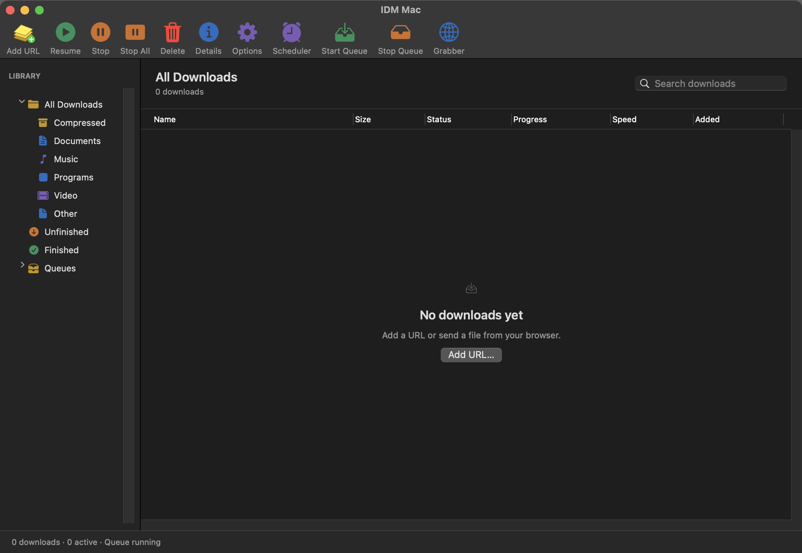
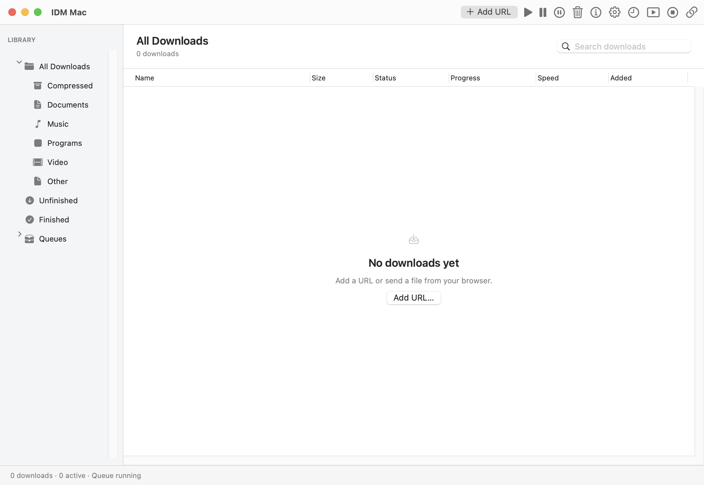

# IDM Classic appearance and v0.2.0 release

## Research and design decision

AgentReach's GitHub CLI backend searched native download managers and IDM toolbar themes on 2026-10-09. Primary references:

- [IDM main window](https://www.internetdownloadmanager.com/support/main.html) and its [actual screenshot](https://www.internetdownloadmanager.com/support/using_idm/pictures/main-w.png): labeled action toolbar, categories on the left, compact file rows and a status bar.
- [IDM customization](https://www.internetdownloadmanager.com/support/customization.html): classic/other toolbar styles and toolbar button arrangements.
- [Windows 10/11 toolbar reference](https://github.com/mkcs121/IDM_Toolbar_Win10_11) and [Fluent toolbar reference](https://github.com/dawid9707/IDM-Toolbar-Fluent): alternate Windows toolbar visual treatments. GitHub reported no repository license for these references; their bitmap assets are not included.
- [Harbor](https://github.com/thsnkhn/harbor) and [Mac Download Manager](https://github.com/ephraimduncan/mac-download-manager): native Mac download-manager navigation references. No implementation is copied from them.

The requested Windows familiarity determines the default: **Classic IDM Toolbar**, with colored action icons, text labels, compact 30-point file rows and colored category symbols. The native **Compact Mac Toolbar** remains available with smaller monochrome controls and 44-point filename/source rows. Both layouts retain the same actual download commands and selection identity.

The icons are independently drawn or rendered from system symbols. Add URL uses an authored yellow paper stack and green plus; resume, stop, delete, options, scheduler, queue and grabber retain recognizable action metaphors. This is not a pixel-perfect copy of Tonec artwork.

## Appearance behavior

View offers Classic/Compact and Light/Dark/Follow System. Preferences persist for the normal installed app; isolated smoke/acceptance instances do not change them. Layer surfaces update when effective system appearance changes. Details follow the selected application appearance.

Actual AppKit smoke checks exercise both toolbar layouts, light/dark appearance, release of the system override, minimum window width and all eleven commands. End-to-end checks download a fixture, verify SHA-256, pause/resume through real toolbar handlers and check search selection and failed-job actions. Screenshots depict the actual app.

## Release scope

Version 0.2.0 targets macOS 13 or later and packages Apple Silicon (`arm64`), Intel (`x86_64`) and Universal binaries. Deployment checks and executed runtime environments are recorded in [macOS compatibility](../macos-compatibility.md). Older macOS and 32-bit/PowerPC Macs are unsupported. Build targets do not establish tests on every Mac model or every macOS release.

CI separates bounded extension, fixture, core, package, UI, native-host and signature/proof stages on ARM/Intel macOS runners. The previous job's repeated fixture delays were caused by unnecessary reverse DNS in HTTPServer startup; fixtures now bind without reverse lookup, and a regression verifies real HTTP checks with DNS unavailable. Keychain was already passing and was not changed.

## Actual app screenshots

