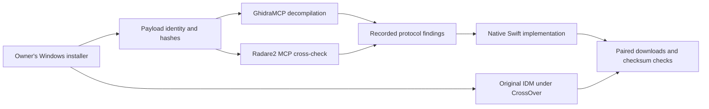

# How the macOS implementation was built

IDM Mac is an independent personal macOS project. It is not an official Tonec product or an endorsed IDM release. The owner's licensed Windows software supplies the reference for analysis and behavior comparison. Native macOS code is authored in Swift and AppKit.

## Provenance

| Artifact | Identity |
| --- | --- |
| Original installer | `idman643build15.exe`; SHA-256 `a902e77169a3e4d8a88ee2ccaab11d3d43ab209483625a3602438ed4a22bbfd9` |
| Extracted application and installed reference | `IDMan.exe`, 6.43 build 15.2, PE32 x86, image base `0x00400000`; SHA-256 `e3fc655a335e17a6fdd09a9b315291d0c8863180f0d801e5dd7433c9e56afbd8` |
| Runtime reference | CrossOver 26.3, project-local `IDM-Reference` bottle on Apple Silicon macOS |

The fresh reference installation displays its trial reminder. The owner's license key has not been copied into this bottle or repository. Benchmarks use the normal application functionality and supported command-line interface; no activation logic is modified.

## Evidence chain

1. **Extract and identify.** The reproducible [installer extractor](../scripts/extract_installer.py) inventories zlib payloads and identifies the application through PE/version resources. [Version metadata](../analysis/raw/application-version.json) distinguishes the download manager from its installer.
2. **Analyze through GhidraMCP.** The stdio MCP client invokes the real headless server, imports the extracted application, saves analysis, and exports decompilation and cross references. [Range builder output](../analysis/raw/ghidra-decompile-005ae8e0.json) records the original function at `0x005ae8e0`.
3. **Cross-check through Radare2 MCP.** [Independent references](../analysis/raw/r2mcp-range-xrefs.json) and [instructions](../analysis/raw/r2mcp-range-call.json) check the range-request call at `0x005af215`. [Content-Range instructions](../analysis/raw/r2mcp-content-range-call.json) support the header-parsing interpretation.
4. **Record interpretation and limits.** [HTTP engine findings](findings/http-engine.md) distinguish observed instructions from inferred behavior. Complete proprietary object layouts, dynamic segmentation, and scheduler algorithms are not established.
5. **Implement native equivalents.** Swift URLSession performs HTTP/TLS, AppKit supplies native windows, SQLite persists jobs, Keychain holds Basic credentials, and bounded on-disk segments preserve restart/resume behavior.
6. **Execute both implementations.** Original IDM downloads the same public installers through its [documented command-line interface](https://www.internetdownloadmanager.com/support/command_line.html). Timed full-file completion and matching SHA-256 hashes establish the recorded comparisons.

## Native architecture

| Component | Responsibility |
| --- | --- |
| `DownloadEngine` | Range negotiation, validators, retries, partial files, integrity checks, assembly |
| `HTTPChunkStream` | Delegate-delivered data chunks, reusable URLSession connections, queue backpressure |
| `JobStore` | SQLite snapshots and recovery of interrupted jobs |
| `CredentialStore` | macOS Keychain storage and retrieval |
| `QueuePolicy` | Due-time and FIFO selection |
| AppKit controllers | IDM-inspired light interface, toolbar actions, details, and failure guidance |

The initial engine consumed asynchronous bytes individually. Benchmarking exposed throughput overhead on some downloads; chunk delivery removes that per-byte application loop while retaining validation, throttling, and partial-file behavior. Release comparisons and regression tests establish the actual results of this change. The subsequent 5 GiB check exposed temporary Foundation object retention; per-block autorelease pools bound assembly/checksum temporaries, and the opt-in acceptance test now asserts peak RSS below 1 GiB.

## Tools used

- **Ghidra 12.1.2 / pyghidra 3.1.0 / GhidraMCP:** real decompilation, references, imports, strings, saved analysis.
- **Radare2 MCP / rabin2:** independent PE triage and instruction/reference checks.
- **CrossOver 26.3:** execution of the original Windows IDM on the same Mac.
- **Windows API probe, built with MinGW:** original IDM window/control observations and normal dialog acknowledgment in the isolated bottle.
- **Swift 6, AppKit, URLSession, SQLite, Security/Keychain:** implementation and native integration checks.
- **Python, curl, SHA-256, LLVM coverage tools:** fixtures, independent download references, paired timing, integrity, and executable coverage.
- **OpenQodex 0.8.1 with Codex reviewer:** code reviews whose findings and corrections are recorded in the repository.

## Scope and distribution

Browser integration is independently implemented with a Swift host and Chromium/Firefox WebExtensions; see [browser setup and actual test evidence](browser-integrations.md). Live ordinary `blob:` data can stream from its originating tab; arbitrary pasted or expired Blob identifiers remain unavailable. Browser challenges and expired signed URLs remain external access constraints. [Feature coverage](parity.md) records unsupported and unverified behavior. Original executables, extracted proprietary payloads, license keys, cookies, and local runtime data remain outside Git. The application bundle is locally ad hoc signed for the owner's Mac.
