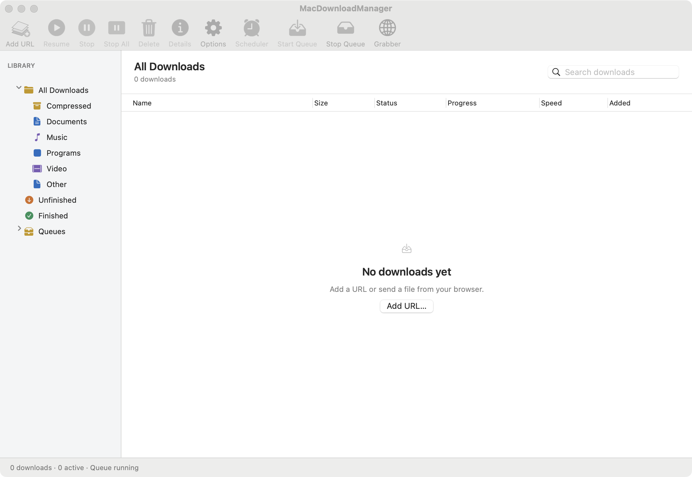

# Real URL and native UI verification

Tested on 2026-10-08 using real URLSession downloads. Full files were compared with separately downloaded curl references using SHA-256, then temporary fixtures were removed.

| URL / source | Observed result |
| --- | --- |
| VS Code stable Apple Silicon DMG | Passed: 295,206,425 bytes; full SHA-256 matched |
| Cursor 3.23 Apple Silicon DMG | Passed: 294,097,415 bytes; full SHA-256 matched |
| Antigravity 2.21.1 Apple Silicon DMG | Passed: 206,573,240 bytes; full SHA-256 matched |
| Fresh convt v0.3.0 Apple Silicon DMG | Passed: 50,016,928 bytes; full SHA-256 matched |
| User-provided signed GitHub asset URL | Native engine returned HTTP 618; its expiry is 2026-10-07 21:46:29 UTC, before this test. Use the stable release download URL to obtain a fresh redirect. The signed query is not committed. |
| testfile.org/1.3GBiconpng | Native engine returned browser-verification error; independent GET returned HTTP 403 with `cf-mitigated: challenge`. No successful download claimed. |
| Hark, IGI QVM editor, and Cursor blob URLs | Each rejected with the specific browser-local URL message. Blob data requires access to its originating browser environment; browser integration remains excluded. |

[Raw public installer results](real-download-results.json) include URLs, byte counts, and hashes. The GitHub reference SHA-256 is `97784e68a1c5a8ae63630608559d1cab681f695f1c714dac222230b57643fe9f`.

## Native UI end-to-end checks

The actual release app runs against a loopback HTTP fixture in isolated storage. Checks create a job through the queue, invoke toolbar Stop and Resume, verify the completed file SHA-256, open Details, and check the failed-job banner and retry actions. This found and fixed lost row selection during progress updates. Completed progress bars are explicitly determinate and checked at 100%. Light-theme snapshots were inspected at default and minimum window sizes.

## Coverage

- 43 core checks passed; native queue/toolbar end-to-end checks passed.
- Core executable line coverage: **96.82%**; region coverage: **86.70%**.
- UI executable line coverage: **81.44%**; region coverage: **66.47%**.
- Core and UI are reported separately to avoid duplicate linked core instrumentation. Swift LLVM coverage does not report branch counts here; region coverage is recorded instead.
- Coverage is **not 100%**. Remaining lines include modal interaction paths, platform error handling, and defensive/unreachable paths. Passing checks do not prove universal website access.

Run `scripts/coverage.sh` for exact reports and browsable uncovered lines under `build/coverage/html/`. OpenQodex is a code review in addition to these executed tests, not a substitute for them.

Blob URL behavior is documented by [MDN](https://developer.mozilla.org/en-US/docs/Web/URI/Reference/Schemes/blob). Saved proxy settings are excluded from isolated smoke and end-to-end runs.

## OpenQodex review

Code reviews are recorded per change; review reports are regenerated and not kept as historical attachments.

## Subsequent performance release

The chunk-stream release passes **47 checks**, including backpressure, pre-header cancellation, and credential redirect boundaries. Latest core line coverage is **97.05%** (region coverage **87.53%**); UI line coverage remains **81.44%**. See [verification](verification.md).

The subsequent large-file memory correction is also tested. Latest measured coverage after adding scoped autorelease pools is **96.90% core lines** and **81.44% UI lines**. Earlier percentages above identify their respective earlier builds.
