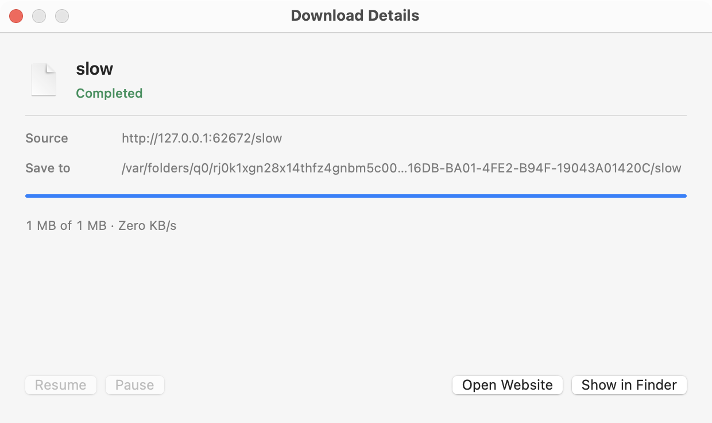

# Verification record

Machine: Apple Silicon, macOS 15.3.1; Swift 6.0.3 Command Line Tools. Tests use the real release-mode engine.

## Previous release checks

- 47 deterministic functional checks passed: ranges; ignored-range fallback; weak ETag/Last-Modified fallback; single-stream transfers; retries during HEAD and GET; redirects; Basic authentication and rejection; HTTP proxy routing; Keychain CRUD; unknown lengths; empty files; malformed ranges; changed resources; HTTP errors; truncation; collision preservation; pause/resume; speed limiting; HTML page rejection; attached HTML files; browser-verification errors; SQLite recovery; URL validation; queue scheduling; safe batch filenames; missing validator fallback; and empty-file HEAD fallback; and HTML base URL resolution; and inactive markup exclusion; chunk-stream backpressure; cancellation before response headers; same-origin credential redirects; and cross-origin credential removal.
- Real trusted HTTPS download matched a separately fetched SHA256 reference.
- Full 5 GiB loopback download: **5,368,709,120 bytes**, full-file SHA256 matched the independently generated pattern, **253 seconds**. Generated files were removed after the check. This run preceded the final response-header-only review fixes; affected fallback and HTML paths were rechecked separately.
- Release `.app` built and its ad hoc signature verified.
- Native window smoke check: visible, six download columns, eleven category rows, eleven toolbar items, layout checked at 1100 and 900 pixel widths; scheduled jobs remain queued after termination. Actual rendered views are captured under ignored `build/`.
- Python analysis/fixture scripts compile; shell scripts parse; `git diff --check` passes.

## OpenQodex

The initial review found missing HEAD retries and inflated retry progress. The next review found validator selection inconsistency and missing GET HTML rejection. Subsequent reviews found unsafe batch filenames, missing-validator fallback, queued-job termination, and empty-file HEAD fallback; and HTML base URL resolution; and inactive markup exclusion. These findings were fixed and regression-tested. The full delivery review (`d5c43bb70057`, against `1ebe3ec`) reported one minor grabber base URL issue, which was corrected and regression-tested. The correction review identified inactive markup handling, which was replaced with native HTML parsing and regression-tested. Final parser review (`c638826b19d6`, against `2d3fca1`) passed with **no findings on the changed lines**. Earlier full reviews and this final correction review together cover the implementation; the final review alone is not a new full audit. Raw review reports remain in ignored `build/`.

## User-reported Testfile.org failure

`https://testfile.org/files-5GB` returned HTTP 403 for both HEAD and GET, with `cf-mitigated: challenge`, and a browser-verification page. The initial native failed job recorded HTTP 403 with zero bytes. The app now reports browser verification clearly, supports GET fallback when HEAD alone is forbidden, and provides an Open Page action in Details. The specific external endpoint remains dependent on the site's access decision; the local 5 GiB test does not claim that this website was downloaded successfully.

## Limits

Checks establish the documented native behaviors. The paired benchmark establishes measured throughput for three installers under CrossOver. It does not establish full IDM parity, universal throughput equivalence, every proxy/auth scheme, or long-duration production reliability. The package is locally ad hoc signed for personal use, not notarized for public distribution.

## Follow-up download and light-theme checks

See [real URL verification](real-url-verification.md) for installer hashes and earlier checks. That release passed 47 core checks plus actual native toolbar pause/resume and checksum verification. That release measured **96.90% core** and **81.44% UI** line coverage; core region coverage is **87.53%**. Reports are recorded separately to avoid duplicate linked core instrumentation.

The chunk engine also completed the full 5 GiB fixture with matching SHA-256 in **111 seconds** before the final redirect/default-connection changes; their affected paths passed the subsequent full suite. See [speed comparison](speed-comparison.md) for original IDM measurements and limitations.

## Performance release review

OpenQodex 0.8.1 reviewed the final chunk-stream, resolved-URL, credential-boundary, default-connection, fixture, and benchmark changes against `9aa16c7` (change `6c7ff9e08f66`): **no findings on the changed lines**. [Recorded report](openqodex-performance-review.md). This is a scoped code review, not proof of complete parity or universal reliability.

The subsequent 8-MiB/16-connection release and observer regression correction were reviewed against `c730f5e` (change `9a47b2996f5e`): **no findings on the changed lines**. [Release report](openqodex-release-review.md). The observer self-test creates synthetic Edit and Static controls and verifies that Edit text is never read while normal labels remain observable.

## Large-file memory regression

The final acceptance run exposed temporary Foundation object retention during assembly and checksum reads. It was stopped before a verified result; its generated file and fixture were removed. Per-block autorelease pools fix these paths. The corrected full 5 GiB check passed in 86 seconds with 465,879,040 bytes peak RSS. An automatic **1 GiB peak RSS** assertion now accompanies the opt-in large-file checksum test. OpenQodex reviewed the complete correction and assertion against `6cb8302` (change `dd8d85537d04`): **no findings on changed lines**. [Memory review](openqodex-memory-review.md). Latest measured core line coverage is **96.90%**, UI **81.44%**; these are measured limits, not a 100% coverage claim.

The final assertion-enabled release acceptance also passed: **5,368,709,120 bytes**, complete SHA-256 match, **90 seconds**, **462,143,488 bytes** peak RSS (about **441 MiB**, below the **1 GiB** asserted limit). [Acceptance log](large-file-test-results.txt), [OS resource measurements](large-file-memory-resources.txt). Generated files were removed. This supersedes the earlier incomplete attempt and complements the historical runs above.

## Browser integration and UI acceptance — 2026-10-09

The complete `scripts/test.sh` passed on the final source tree: **19 Node tests**, **1 acceptance-helper regression**, **58 core checks**, release packaging/signature checks, native AppKit smoke and end-to-end checks, and **5 packaged native host/app acceptance groups**. AppKit tests verify actual download SHA-256, toolbar pause/resume, completed details, filename search and no-match state, selected identity across filtered rows, failed-job retry actions, startup URL queue delivery, scheduled-job termination and the 900-pixel minimum width.

Actual final-release browser runs passed **12 Chromium checks** and **11 Firefox checks**, including live Blob imports and full-file fixture hashes. Firefox also verifies permission-granted cookie transfer and replacement GET recovery when a paused nonrange download cannot resume after missing-host failure. See [browser setup and precise limitations](browser-integrations.md) and [recorded browser results](test-results/browser-current.json).

Fresh instrumentation was rebuilt after the UI/Grabber changes; only profiles from that build's core, UI, native-host and real browser acceptance were merged. Linked core instrumentation is excluded from UI/host reporting:

| Target | Line coverage | Region coverage | Report |
| --- | --- | --- | --- |
| Native core | 97.37% | 88.96% | [Core](test-results/core-coverage.txt) |
| AppKit app and bridge | 84.05% | 65.77% | [App](test-results/ui-coverage.txt) |
| Native messaging host | 89.33% | 76.29% | [Host](test-results/host-coverage.txt) |

These measurements are not 100% coverage. Some native approval/cancellation, registration, exceptional transport paths and interface actions remain outside instrumented acceptance. Safari destination approval and full transfer remain unverified, as do individual branded Chromium browsers and Firefox private/container recovery. The Chrome cookie-permission automation path remains incomplete. Existing Safari privacy settings were preserved.

The integration engine completed the assertion-enabled **5 GiB** fixture: **5,368,709,120 bytes**, full SHA-256 match, **136 seconds**, **399,671,296 bytes peak RSS**, below the asserted 1 GiB limit. [Acceptance log](test-results/browser-large-file.txt). Generated large files were removed. This run precedes UI and Grabber-only changes; transfer-engine code was unchanged afterward.

The professional UI refinement uses compact native monochrome controls, a restrained category sidebar, filename/source rows, search, numeric progress and a reorganized details panel. Screenshots come from actual AppKit fixture transfers; the failed row deliberately exercises the browser-verification error path.

All three recorded OpenIGI OS endpoints completed and matched independent full-file SHA-256 references. Segment settings, reused native evidence, earlier failures and the live-page change are recorded in [OpenIGI verification](openigi-verification.md).

The actual code-review sequence, findings and corrections are recorded in [browser review](openqodex-browser-review.md). Native host cold startup was separately verified after allowing a 20-second launch deadline; [installed-host result](test-results/installed-autolaunch.json). Production extension resources exclude diagnostic pages; test controls are staged only in owned QA directories.
